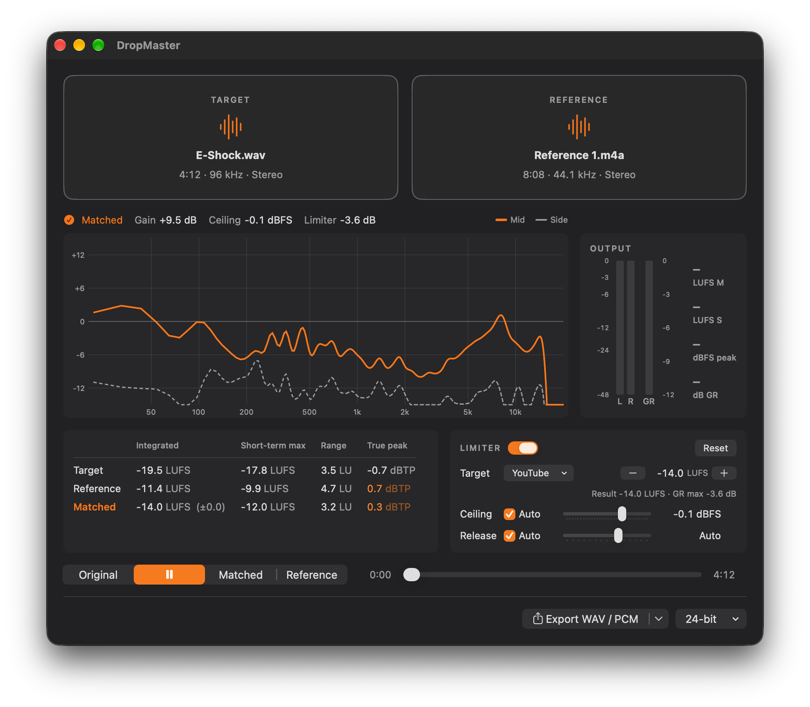

# DropMaster

Reference mastering by drag and drop, for macOS. Drop the track you want to
master (the **target**) and a finished record that sounds the way you want
(the **reference**). DropMaster matches the target to the reference in
loudness, tonal balance and stereo width, and limits it to the reference's
peak level.

Native Swift. No Python, no ffmpeg, nothing to install: decoding,
resampling, FFT, playback and export are Core Audio, AVFoundation and
Accelerate. The one library inside is LAME, for MP3 export only, compiled
into the app (see `THIRD_PARTY_NOTICES.md`).



```
No SignUp
No User Profiling
No Tracking
No Cookie Banners
No Terms & Conditions
No Paywalls
No Ads
No Data Mining
```

DropMaster is an offline application. It has no network code, contacts no
server and collects no analytics; it is sandboxed and built without the
network entitlement, so it cannot open an outgoing connection even if it
tried. Its only entitlements are the sandbox itself and read-write access
to the files you pick.

## Using it

1. Drop a target and a reference onto the two zones (or click a zone to
   choose a file). WAV, AIFF, CAF, FLAC, ALAC, AAC/M4A and MP3 all work;
   anything not at 44.1 kHz is resampled, mono is played on both sides.

   The reference has five slots: the buttons **1 2 3 4 5** under its zone.
   The zone always shows the active slot, and choosing another one (click,
   or ⌥⌘1 … ⌥⌘5) matches the target against that reference again. That
   takes about half a second, because each slot keeps its decoded audio
   (about 110 MB for a five-minute song). A file dropped on a number goes
   straight into that slot and makes it active. Right-click a number to
   choose a file or clear the slot. Slots are not kept after the app quits.
2. Matching starts on its own and takes about a second. The curves show the
   tone correction for Mid (solid) and Side (dashed); beside them, the
   overall gain, the ceiling and the deepest limiter reduction.
3. **Original · Pause · Matched · Reference** switches between the two
   versions at the same moment of the song, and to the reference at the same
   time in seconds (it wraps round when it is shorter than the target).
   Space plays and pauses, ⌘1 / ⌘2 / ⌘3 pick Original / Matched / Reference.
   There is no loudness compensation - the level change is part of the
   result, and hearing Matched against Reference at their own levels is the
   point.
4. **Export** (bottom right, ⌘E) writes the matched track in any of eight
   formats. The left box exports; its arrow picks the format.
   The right box picks the quality:

   | Format | Quality |
   |---|---|
   | WAV / PCM, AIFF / PCM, CAF | 16-bit · 24-bit · 32-bit float |
   | M4A / AAC, AAC / ADTS | 256 · 192 · 128 kbps |
   | M4A / ALAC, FLAC | 16-bit · 24-bit |
   | MP3 | 320 · 256 · 192 kbps CBR · VBR V0 · VBR V2 |

   Always 44.1 kHz stereo. Integer depths get TPDF dither (±1 LSB). For AAC
   and MP3, set the limiter's Ceiling to about −1.0 dBFS: lossy codecs rebuild
   peaks higher than the samples. The choice is remembered on this Mac.

## Metering

- **Loudness table**: integrated loudness (EBU R128, gated), the loudest
  3 seconds (short-term max), loudness range (LRA, EBU Tech 3342) and true
  peak (4× oversampled, dBTP) for target, reference and the matched result.
  The matched row shows its distance to the reference. A true peak above
  0 dBTP turns orange: lossy encoding or a D/A converter will clip there.
- **Output meter** (what is playing, after the A/B switch): L/R peak bars
  (0 to −12 dB take the upper half of the scale), the limiter's gain
  reduction at the playhead while Matched plays, and LUFS M (400 ms) /
  LUFS S (3 s). Starting playback or seeking starts a fresh measurement.

## Limiter

Changes re-run only the limiter on the prepared match (well under a second
for a whole song); playback carries on with the new result.

- **Limiter on/off.** Off: no limiting - the result is turned down until its
  peaks fit under the ceiling, so it is quieter than the reference.
- **Target** is the only level control. *Match reference* aims at the
  reference track's own integrated loudness; the presets are the streaming
  platforms' levels (YouTube −14, Deezer −15, Apple Music −16, Qobuz −18
  LUFS). Any other level is set
  with − / + beside the box: −24 … −6 LUFS in 0.5 LU steps (⌥ for 0.1; the
  buttons repeat while held). Pressing − or + while *Match reference* is
  chosen starts from the reference's own loudness and switches the box to
  "Custom"; the box names the platform whose level a value is. With a target, the gain is searched until
  the *limited* result measures it (usually one or two passes). A target
  the limiter cannot reach without clipping is shown in orange with the
  loudest level it managed; the export still works. Platforms turn louder
  masters down and ask for true peaks ≤ −1 dBTP, so a Ceiling of −1.0 suits
  them.
- **Ceiling**: Auto (the reference's own peak, never above −0.1 dBFS) or
  −3.0 … −0.1 dBFS. The ceiling limits sample peaks; streaming services ask
  for true peaks at or below −1 dBTP, so lower it until the table's true
  peak column says so.
- **Release**: Auto (60 ms after a lone peak, up to 600 ms through dense passages) or
  one of 15 stops from 10 ms to 1 s (10, 15, 20, 30, 40, 50, 70, 100, 150,
  200, 300, 400, 500, 700, 1000).

The settings are remembered on this Mac.

Target and reference may each be 3 seconds to 20 minutes long.

## Presets

**File › Save Preset…** (⌘S) saves all five reference slots in one file,
with or without a target loaded: for each slot what the match needs from
its reference - the smoothed Mid and Side spectra of its loud passages,
their level, its peak and its loudness figures - plus which slot was
active and the limiter settings. **Open Preset…** (⌘P) puts all five back.
They then stand in for the references, so a whole album can be matched
against the same five records without loading them again. The result is
the one the files themselves give: the match always runs on this
measurement, whether it was just taken from a file or read from a preset.
The references' audio is not in the file, so **Reference** preview (⌘3)
needs the file dropped in again.

Both dialogs open in the folder of the active reference, where its presets
belong - or, without a file loaded, where the last preset was opened or
saved. Limiter settings are applied when a preset is opened, not every
time a slot is chosen. **Close Preset** empties the active slot; dropping a
reference into a slot replaces what the preset put there.

The spectra are stored 24 points per octave from 20 Hz to 20 kHz, to
0.01 dB. In the harness a match through the stored form nulls 45 dB below
the music against the in-memory measurement. A preset of five slots is
readable JSON of about 40 kB, extension `.dmpreset`.

Presets from DropMaster 1.1 and earlier hold one correction curve, measured
against the target of that day. They still open, into the active slot,
and a set saved afterwards keeps them as they are.

Loudness is still measured per song: a preset aims at the LUFS its
reference had, or at the target set in the limiter panel.

## How it matches

- **Mid/Side**: centre and sides are analysed and corrected separately,
  which is what carries the reference's stereo width across.
- **Loud blocks**: both tracks are cut into 3-second blocks; only blocks at
  or above the track's average power count, so intros, breakdowns and
  fades do not skew the measurement.
- **Tone**: mean power spectra (4096-point FFT, Hann, 50 % overlap) over the
  loud blocks; the reference/target ratio is smoothed with a Gaussian about
  1/6 octave wide, held flat below 20 Hz and above 20 kHz, clamped to
  ±15 dB, and applied as a 4096-tap linear-phase FIR. The filter delay is
  removed, so the result is sample-aligned with the original.
- **Level**: gain so the loud blocks' Mid RMS equals the reference's,
  measured three times on a copy clipped at the ceiling.
- **Limiter**: look-ahead brickwall (3 ms, programme-dependent release),
  ceiling = the reference's peak, never above -0.1 dBFS.

One known limit: a reference that was *clipped* to its loudness cannot be
reached without clipping, and DropMaster does not clip. Against pink noise
clipped by 12 dB the result stays about 3 dB quieter (see the harness).

## Origin

The idea - match RMS, frequency response and stereo width to a reference,
then limit - is the one [Matchering](https://github.com/sergree/matchering)
made popular. DropMaster is a clean-room implementation: no Matchering code,
comments or text were used, and its methods differ (block selection,
smoothing, filter design, limiter). Matchering is GPLv3; DropMaster is MIT.

## Building

- Xcode 26, macOS 26.5, Apple Silicon.
- `./build_dmg.sh` - Release build, install to /Applications, and a `.dmg`
  in `build/` (`--no-install` leaves /Applications alone).
- `Verification/run.sh [-O]` - the engine harness: FFT/FIR scaling,
  self-match, tone and level matching on pink noise, the ceiling, WAV
  round trips of every export format and quality, the decoder, the A/B
  player, LUFS / LRA / true peak on the EBU test signals, the limiter
  settings, and presets (curve accuracy, round trip, matching through one;
  reference profiles against the old curve maths, sets of five slots,
  damaged and future files refused).
- `swift Tools/make_icon.swift` - redraws the app icon.

## Licence

MIT — see [LICENSE](LICENSE). Bundled libmp3lame is LGPL-2.0; details in
[THIRD_PARTY_NOTICES.md](THIRD_PARTY_NOTICES.md).

## Contact

T'Zorr — <TZorr@gmx.de>
